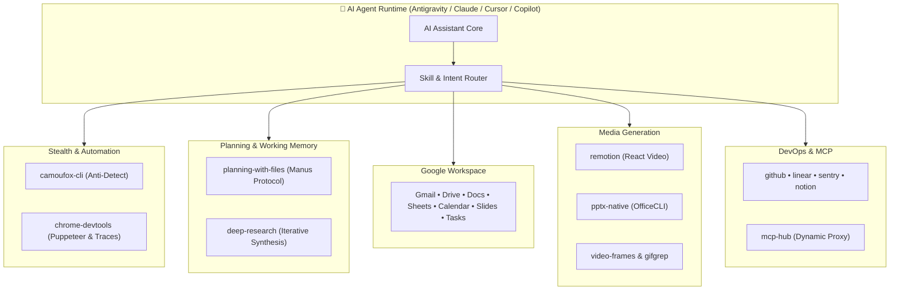

<div align="center">

# 🧠 AI Agent Skills Suite

<p align="center">
  <b>The definitive, enterprise-grade superpower toolkit for autonomous AI coding agents.</b><br/>
  <i>Anti-detect browser automation, live Chrome DevTools engine, Manus-style infinite memory planning, deep research synthesis, full Google Workspace cloud suite, and programmatic media generation.</i>
</p>

<p align="center">
  <a href="https://github.com/ibrdot/ai-agent-skills/stargazers"></a>
  <a href="https://github.com/ibrdot/ai-agent-skills/network/members"></a>
  <a href="https://github.com/ibrdot/ai-agent-skills/blob/main/LICENSE"></a>
  <a href="https://github.com/ibrdot/ai-agent-skills"></a>
  <a href="https://github.com/ibrdot/ai-agent-skills"></a>
</p>

<!-- Viral Tags Cloud -->
<p align="center">
  <code>#ai-agents</code> •
  <code>#model-context-protocol</code> •
  <code>#chrome-devtools</code> •
  <code>#browser-automation</code> •
  <code>#manus-ai</code> •
  <code>#deep-research</code> •
  <code>#google-workspace</code> •
  <code>#remotion</code> •
  <code>#antigravity</code> •
  <code>#claude-code</code> •
  <code>#cursor-ai</code>
</p>

<br/>

[✨ Features](#-key-highlights) • [⚡ 10x Agent Superpowers](#-the-10x-superpower-comparison) • [📦 Skills Catalog](#-skills-catalog) • [🌐 Google Workspace](#-google-workspace-gws-suite) • [🔍 Chrome DevTools](#-chrome-devtools-engine-dual-mode) • [💬 Quick Test Prompts](#-ready-to-use-prompts) • [🚀 Quick Start](#-quick-start--installation)

---

</div>

## 🌟 Key Highlights

> [!TIP]
> **Zero Configuration Required**: All skills work directly via your agent's terminal execution (**Standalone CLI & Script Mode**) with no extra server setup required, or seamlessly as **MCP Servers** when configured.

| Pillar | Core Skill | What It Gives Your Agent |
| :--- | :--- | :--- |
| 🛡️ **Stealth Browser** | [`camoufox-cli`](./camoufox-cli) | Anti-detect Firefox with C++ fingerprint spoofing to bypass Cloudflare, bot protections, and captchas. |
| 🔍 **Live DevTools Engine** | [`chrome-devtools`](./chrome-devtools) | Full Puppeteer control, live console logs, network request interception, heap snapshots, and Core Web Vitals. |
| 🧠 **Manus-Style Memory** | [`planning-with-files`](./planning-with-files) | Persistent disk memory (`task_plan.md`, `progress.md`) surviving context window clears with auto-catchup. |
| 🔬 **Deep Research Framework** | [`deep-research`](./deep-research) | Recursive multi-source intelligence gathering, competitive analysis, and automated report synthesis. |
| 🎬 **Programmatic Video** | [`remotion`](./remotion), [`video-frames`](./video-frames) | React-based video generation, automated motion graphics, audio sync, and FFmpeg frame extraction. |
| 📊 **Enterprise PPTX Engine** | [`pptx-native`](./pptx-native), [`pptx`](./pptx) | Element-level editable PowerPoint authoring via OfficeCLI and AI vision raster slide generation. |
| ☁️ **Full Google Workspace** | [`gws-*`](./gws-shared) | End-to-end automation for Gmail, Google Drive, Docs, Sheets, Calendar, Slides, and Tasks. |

---

## ⚡ The 10x Superpower Comparison

| Without These Skills ❌ | With AI Agent Skills Suite 🚀 |
| :--- | :--- |
| **Trapped in Text**: Can only chat and offer advice. | **Real-World Action**: Automates real browsers, sends emails, debugs live websites. |
| **Blocked by Cloudflare/Bots**: Gets 403 Forbidden on modern web. | **Stealth Bypass**: Spoofs canvas, WebGL, audio, and navigator fingerprints. |
| **Forgets on Long Tasks**: Context window fills up, agent loses progress. | **Manus Memory**: Writes plans to disk and auto-resumes after `/clear`. |
| **Blind to Web Performance**: Cannot see page load bottlenecks. | **Deep DevTools**: Records performance traces, LCP, CLS, INP, and CrUX field data. |
| **Manual Document Work**: Can only output raw markdown. | **Native Office Output**: Creates editable PowerPoint presentations, Sheets, and Docs. |

---

## 🏛️ Architecture Overview



---

## 📦 Skills Catalog

<details open>
<summary><b>Click to expand full skills directory (24+ Skills)</b></summary>
<br/>

| Skill | Category | Capabilities & Trigger Context | Execution Mode |
| :--- | :--- | :--- | :---: |
| [`camoufox-cli`](./camoufox-cli) | **Web & Stealth** | Anti-detect Firefox browser automation, bypassing Cloudflare/Bot detection, DOM snapshotting. | `CLI` |
| [`chrome-devtools`](./chrome-devtools) | **Web & DevTools** | Live Chrome automation, performance tracing, network interception, heap inspection, and debugging. | `CLI + MCP` |
| [`deep-research`](./deep-research) | **Research** | Iterative multi-source deep research, competitive intelligence, and structured research reports. | `Skill` |
| [`planning-with-files`](./planning-with-files) | **Task Planning** | Manus-style file-based planning (`task_plan.md`, `progress.md`) with automatic session recovery. | `Skill` |
| [`github`](./github) | **DevOps** | Repository management, PR review workflows, issue triage, and CI failure debugging. | `Connector` |
| [`linear`](./linear) | **Project Mgmt** | Issue tracking, cycles, team boards, roadmaps, and automated ticket synchronization. | `Connector` |
| [`sentry`](./sentry) | **Observability** | Exception investigation, crash triage, issue resolution tracking, and incident summaries. | `MCP` |
| [`notion`](./notion) | **Productivity** | Read, create, and update Notion workspace pages, nested blocks, notes, and databases. | `MCP` |
| [`mcp-hub`](./mcp-hub) | **Integrations** | Dynamic discovery and execution proxy for user-configured remote MCP servers. | `MCP` |
| [`pptx-native`](./pptx-native) | **Presentation** | Native editable PowerPoint deck creation via OfficeCLI (shapes, text, animations, tables). | `Skill` |
| [`pptx`](./pptx) | **Presentation** | AI image-backed raster slide deck generator using vision models packaged to PPTX. | `Skill` |
| [`remotion`](./remotion) | **Media & Video** | React-based programmatic video generation, transitions, dynamic captions, and motion graphics. | `Skill` |
| [`video-frames`](./video-frames) | **Media & Video** | FFmpeg-based still frame extraction, scene detection, and short clip clipping. | `CLI` |
| [`gifgrep`](./gifgrep) | **Media & Video** | Search GIF providers via CLI/TUI, download animations, and extract frame sequences. | `CLI` |
| [`weather`](./weather) | **Utilities** | Current weather conditions and multi-day forecasts via wttr.in and Open-Meteo. | `CLI` |
| [`moclaw-help`](./moclaw-help) | **Knowledge Base** | In-depth MoClaw product documentation, troubleshooting manuals, and runtime reference. | `Docs` |

</details>

---

## 🌐 Google Workspace (GWS) Suite

Complete cloud-native enterprise productivity integrations:

| Service | Skill | Key Capabilities |
| :---: | :--- | :--- |
| ✉️ | [`gws-gmail`](./gws-gmail) | Send, search, parse attachments, read email threads, and manage drafts. |
| 📅 | [`gws-calendar`](./gws-calendar) | Create events, check calendar availability, reschedule, and manage invites. |
| 📁 | [`gws-drive`](./gws-drive) | File upload/download, shared drive management, folder structures, and permissions. |
| 📝 | [`gws-docs`](./gws-docs) | Read, write, format markdown to Google Docs, and modify document trees. |
| 📊 | [`gws-sheets`](./gws-sheets) | Read/write cell ranges, formula calculation, data extraction, and sheet formatting. |
| 📽️ | [`gws-slides`](./gws-slides) | Generate, restyle, inspect, and update presentation slide decks. |
| ✅ | [`gws-tasks`](./gws-tasks) | Manage task lists, set deadlines, mark items completed, and track progress. |
| 🔑 | [`gws-shared`](./gws-shared) | Unified OAuth patterns, authentication tokens, global CLI flags, and output formats. |

---

## 🔍 Chrome DevTools Engine (Dual-Mode)

The [`chrome-devtools`](./chrome-devtools) suite provides deep browser instrumentation for AI agents.

```
                           ┌──► Standalone CLI Mode (Terminal / Zero Setup)
[ Chrome DevTools Suite ] ─┤
                           └──► MCP Server Mode (Tool-calling in Claude / Cursor)
```

### 🌟 Key Capabilities
- **Automated Puppeteer Control**: Seamlessly open URLs, click, input text, select options, and await DOM readiness.
- **Console & Network Traces**: Real-time console logs with source-mapped stack traces; network payload inspection and request blocking.
- **Core Web Vitals & Tracing**: Record live performance traces, measuring **LCP**, **CLS**, and **INP** with Google CrUX field data integration.
- **V8 Heap Snapshots & Leak Detection**: Compare memory snapshots to isolate detached DOM nodes and memory leaks.

### 🧩 7 Built-In DevTools Specialist Skills

```
chrome-devtools/skills/
├── a11y-debugging/          # WCAG compliance, ARIA diagnostics, contrast audits
├── chrome-devtools/         # Conversational MCP server interface
├── chrome-devtools-cli/     # Terminal-first browser control workflows
├── cookie-debugging/        # Cookie lifecycle, SameSite/Secure flag validation
├── debug-optimize-lcp/      # Largest Contentful Paint diagnostics & fixes
├── memory-leak-debugging/   # V8 heap diffing and detached element cleanup
└── troubleshooting/         # Automated recovery patterns for agent-browser sessions
```

---

## 💬 Ready-to-Use Prompts

Give your AI agent these prompts to immediately see these skills in action:

```markdown
# 1. Anti-Detect Browser Automation
"Navigate to https://example.com using camoufox-cli, take a snapshot of the form, and fill in the fields."

# 2. Performance & LCP Optimization
"Run chrome-devtools to audit the Largest Contentful Paint (LCP) of our staging website and suggest bottlenecks."

# 3. Manus-Style Planning
"Plan a complete 5-phase migration using planning-with-files. Track progress in task_plan.md and progress.md."

# 4. Programmatic Video Creation
"Create a 15-second product teaser video with animated title cards and captions using Remotion."

# 5. Native PowerPoint Deck
"Generate an editable 10-slide quarterly business review deck in PPTX with corporate theme using pptx-native."
```

---

## 🚀 Quick Start & Installation

### 1. Clone the Repository
```bash
git clone https://github.com/ibrdot/ai-agent-skills.git
cd ai-agent-skills
```

### 2. Configure with Your Favorite Agent

#### Antigravity / OpenClaw / Custom Agents
Point your agent environment to the cloned repository path:
```bash
export AGENT_SKILLS_PATH="/path/to/ai-agent-skills"
```

#### Claude Desktop / Cursor / Copilot (MCP Mode)
Add to your `mcp.json` or `claude_desktop_config.json`:

```json
{
  "mcpServers": {
    "chrome-devtools": {
      "command": "npx",
      "args": ["-y", "chrome-devtools-mcp@latest"]
    }
  }
}
```

---

## 🏷️ Viral Search Topics & Tags

<div align="center">

[](https://github.com/topics/ai-agents)
[](https://github.com/topics/model-context-protocol)
[](https://github.com/topics/chrome-devtools)
[](https://github.com/topics/browser-automation)
[](https://github.com/topics/manus)
[](https://github.com/topics/deep-research)
[](https://github.com/topics/google-workspace)
[](https://github.com/topics/remotion)
[](https://github.com/topics/claude-code)
[](https://github.com/topics/antigravity)

</div>

---

## 👤 Author & Community

<div align="center">

**Built with passion by [@ibrdot](https://github.com/ibrdot)**  
*Crafting next-generation autonomous AI capabilities & developer tooling.*

[](https://github.com/ibrdot)
[](mailto:ibrdot@outlook.com)

⭐ **Love this project? Give it a Star on GitHub to support open-source AI!** ⭐

</div>
